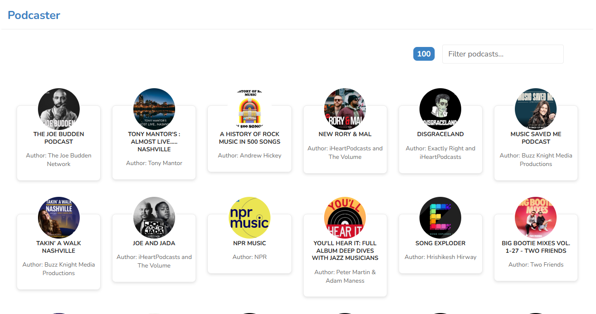
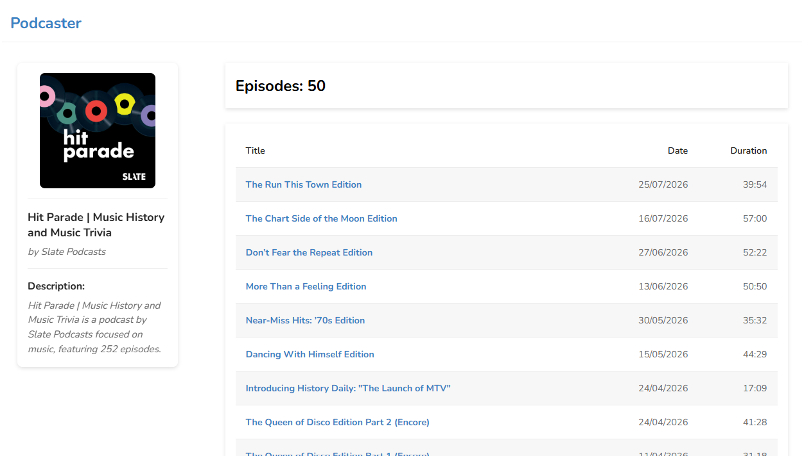
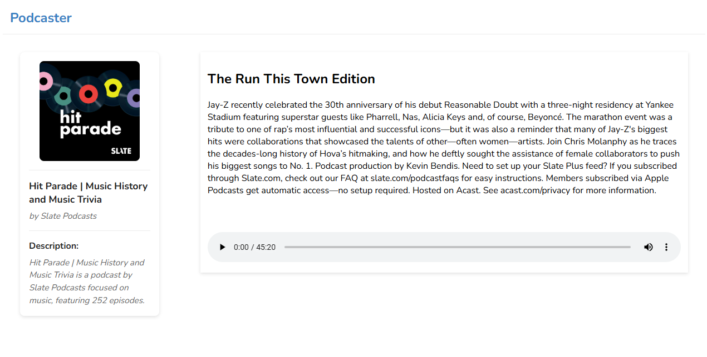

# Podcaster

A podcast application built with React and TypeScript that allows users to browse podcasts, view podcast details, and listen to episodes.

## Features

- Browse podcast list
- Search podcasts by title or author



- View podcast details and episode list



- View episode details
- Audio player for podcast episodes



- Client-side navigation loading indicator

- API response caching with React Query

## Tech Stack

- React
- TypeScript
- React Router
- TanStack React Query
- CSS Modules
- Vite

## Running the Application

### Clone the repository

```bash
git clone https://github.com/Nicolettastr/PD_Test
cd PD_Test
npm install
```

### Development

Run the application in development mode:

```bash
npm run dev
```

Vite serves the application with unminified assets and Hot Module Replacement (HMR).

### Production

Build and preview the optimized production bundle:

```bash
npm run build
npm run preview
```

Vite generates a minified production build with optimized assets.

## Project Structure

```text
src/
├── components/
├── features/
├── hooks/
├── layouts/
├── pages/
├── router/
├── services/
├── types/
└── utils/
```

## Architecture

The application follows a feature-based architecture:

- **features** contains domain-specific logic.
- **components** contains shared reusable components.
- **services** handles API communication.
- **hooks** encapsulate reusable logic.
- **mappers** transform API responses into application models.
- **React Query** manages server state and caching.

## Performance

- Podcast list and podcast details are cached for 24 hours using React Query.
- Client-side search filtering provides instant results while typing.
- DTOs and mappers transform API responses into application models.

## Technical Decisions

- React Query was used for data fetching and caching.
- DTOs and mappers were implemented to decouple API responses from the UI.
- CSS Modules were chosen for component-level styling.
- Custom hooks encapsulate reusable business logic.
- Feature-based folder structure improves scalability and maintainability.

## License

This project was developed as a technical assessment.
